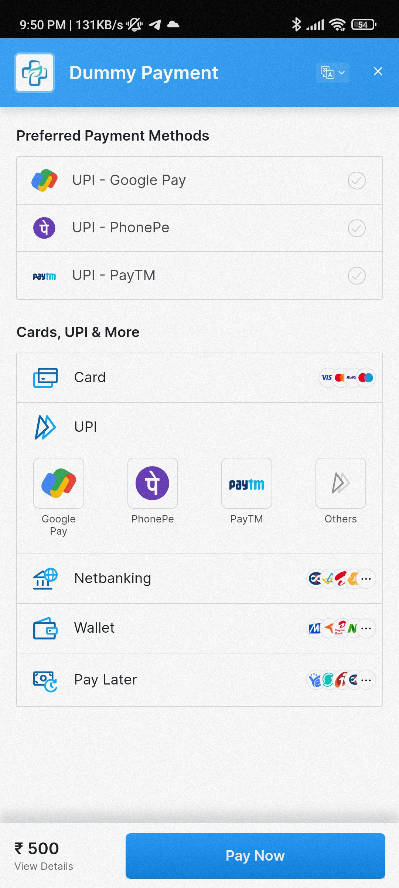

# MedEase - Your Health Companion App

  

Welcome to MedEase, your go-to companion app for efficient health management and medical information. MedEase simplifies your healthcare routine by offering a range of features to track appointments, manage medications, connect with healthcare professionals, and stay updated with the latest medical news.

## Table of Contents

1. [Overview](#overview)
2. [Features](#features)
3. [Technologies Used](#technologies-used)
4. [Screenshots](#screenshots)

## Features

1. **Appointment Tracking:**
   - Schedule, manage, and track your medical appointments seamlessly.

2. **Medication Management:**
   - Keep a record of medications and dosages with a user-friendly interface.
   - Receive push notifications as medication reminders.

3. **Telemedicine:**
   - Connect with healthcare professionals remotely through secure video consultations.
   - Powered by Agora Video Call SDK for a reliable telemedicine experience.

4. **File Attachment for Prescriptions:**
   - Attach files, such as prescriptions, using Firebase Storage.
   - Retrieve and view attached files easily within the app.

5. **Authentication:**
   - Securely log in using Firebase Authentication (custom and Google sign-in).

6. **Payment Integration (Test Mode):**
   - Dummy payment functionality implemented using Razorpay API in test mode.

7. **Dosage Reminder:**
   - Schedule dosage reminders for medications using Alarm Manager and Broadcast Receiver.

8. **Medical Records Storage:**
   - Store and access medical records and test results conveniently.

9. **Medical News Feed:**
   - Stay updated with the latest medical and health-related news.
   - Utilizes the NewsAPI to fetch articles, and displays them using Retrofit.
   - Incorporates Picasso library for efficient image loading.

## Technologies Used

- **Kotlin and Android Studio:**
  - Developed using Kotlin programming language in Android Studio.

- **Firebase:**
  - Firestore database for data storage.
  - Firebase Storage for file attachment.
  - Firebase Authentication for user login.

- **Agora Video Call SDK:**
  - Enables secure and reliable video consultations.

- **Razorpay API (Test Mode):**
  - Implements a dummy payment system for testing purposes.

- **Broadcast Receiver and Alarm Manager:**
  - Used to schedule dosage reminders.
    
- **NewsAPI and Retrofit:**
  - Fetches and displays medical news articles.

- **Picasso Library:**
  - Efficiently loads and displays images in the app.

## Screenshots

## App Screenshots

<!-- Row 1 -->

  
  
  
  

<!-- Row 2 -->

  
  
  
  

  
  
  
  

  
  
  
  

  
  
  
  

  
  
  
  

  
  
  

<!-- Add more rows as needed -->

